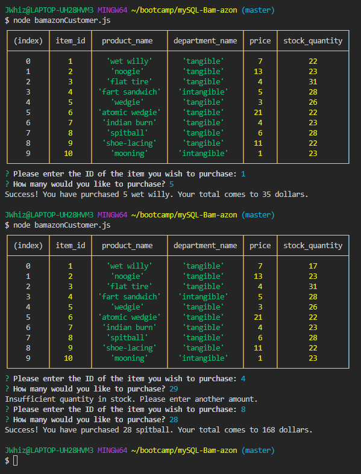
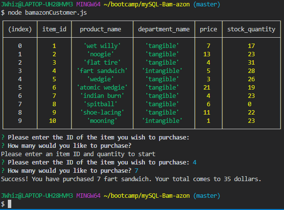
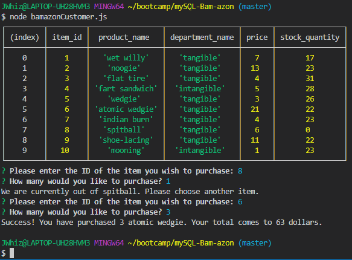

# mySQL-Bam-azon

EXAMPLE COMMAND TO RUN APP:

`node bamazonCustomer.js`

You will be shown a table of all items for sale and prompted to enter item ID and quantity to purchase. If you do not answer both prompts, you will not be able to continue.

Tech used: node.js, mySQL
Libraries: npmjs.com

If there are any questions about this project, please contact jandy@uw.edu.

A big THANKS to Joe, Denis, Trae, Tony, Jonathan, Jered, and Paul for all your insight!
